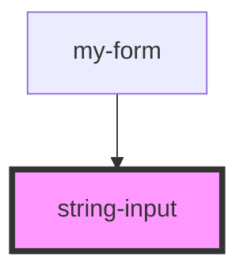

# string-input

<!-- Auto Generated Below -->

## Properties

| Property     | Attribute    | Description | Type                                     | Default     |
| ------------ | ------------ | ----------- | ---------------------------------------- | ----------- |
| `validators` | `validators` |             | `Validators.date \| Validators.required` | `undefined` |

## Events

| Event          | Description | Type                  |
| -------------- | ----------- | --------------------- |
| `valueChanged` |             | `CustomEvent<string>` |

## Dependencies

### Used by

 - [my-form](.)

### Graph

----------------------------------------------

*Built with [StencilJS](https://stenciljs.com/)*
